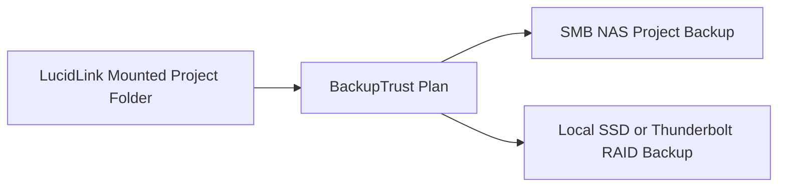
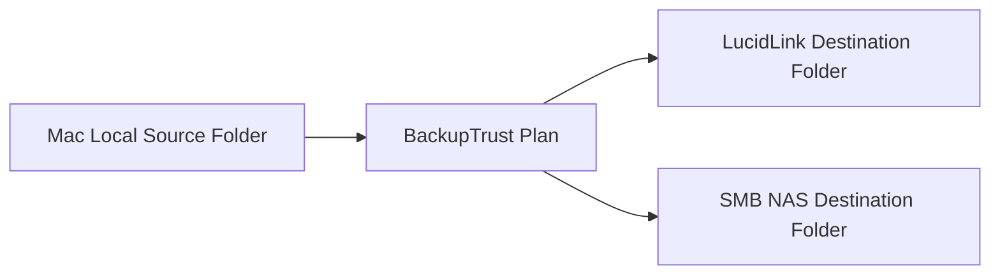
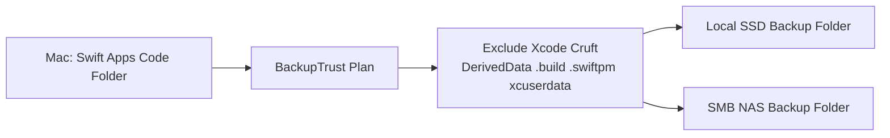
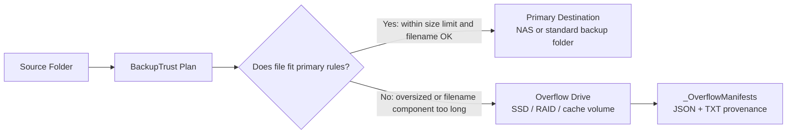

# BackupTrust — Example Workflows

This document shows real-world BackupTrust setups for common macOS backup patterns: local source to local + NAS, LucidLink source to mixed local/network destinations, and local source to both Lucid and SMB storage.

These examples are written around the app's current behavior:
- One plan can copy to multiple destinations.
- Destinations inside a single plan are copied in parallel.
- Multiple enabled plans can also run at the same time today.
- Excluded directories and file filters are applied before copy begins.

If two plans might hit the same destination at once, keep their schedules separated for now. The next planned safety control is an optional Settings rule that prevents multiple plans from writing to the same mounted root volume at the same time.

Folder access note:
- BackupTrust is sandboxed. When you choose a source, destination, or overflow folder, macOS grants saved access to that folder.
- If saved access later expires after an app update, system update, path change, or development rebuild, open the plan in Settings and use **Re-select…** on the affected path.

LucidLink note (1.4 build 7+):
- BackupTrust detects LucidLink volumes automatically — both **Classic** (`lucidfs` kernel mount) and **New** (loopback SMB on `127.0.0.1`). The detected type is logged at the start of each run.
- If the LucidLink source disconnects mid-backup, the primary copy circuit breaker preserves all files already copied, and the overflow phase is skipped entirely.

Post-production tip:
- For any workflow backing up Final Cut Pro projects or libraries (whether the source is LucidLink, local, or NAS), enable the **Final Cut Pro** exclusion preset. This skips `Render Files`, `Transcoded Media`, `.fcpcache` bundles, and `Motion Renders` — all regeneratable by FCP — and can cut backup size and duration significantly.

---

## Quick Pattern Guide

| Workflow | Best when | Source | Destinations |
|---|---|---|---|
| Active Lucid project backup | Your working project lives on LucidLink and needs local/network redundancy | LucidLink-mounted project folder | Local SSD or RAID + SMB NAS |
| Mac folder to Lucid and NAS | You want both cloud-style collaboration storage and a traditional network backup target | Local APFS folder | LucidLink folder + SMB NAS |
| Swift apps code backup | You want fast local recovery plus NAS protection | Local APFS folder | Local SSD + SMB NAS |
| Primary destination plus overflow drive | Your main backup target should stay smaller or cannot accept very large / long-filename files | Any mounted source | Primary destination + separate overflow drive |

---

## Workflow 1 — Active Lucid Video Post Project to SMB NAS and Local SSD or Thunderbolt RAID

### Goal

Back up an actively changing video post project folder mounted from LucidLink to:
- an SMB NAS for network storage
- a local SSD or Thunderbolt RAID for fast local access and recovery

This is a strong working setup when Lucid is the live source of truth for editorial or finishing work, but you want independent copies outside that live mount.

### Recommended Plan

**Plan name**
- `Lucid FCP Project → NAS + Local`

**Source**
- The active project folder inside the LucidLink volume

**Destinations**
- SMB NAS project backup folder
- Local SSD or Thunderbolt RAID folder

**Schedule**
- Hourly for active work
- Add a busy window only if you want backups deferred during peak work hours

**Excluded directories**
- Keep exclusions project-specific and deliberate
- If this is a Final Cut Pro workflow, turn on the **Final Cut Pro** preset to skip regeneratable media and cache content:
  - `Render Files` — FCP render cache including thumbnail and waveform-related generated files
  - `Transcoded Media` — optimized and proxy media generated by FCP
  - `.fcpcache` bundles — FCP analysis and cache data (matched by suffix, so `MyProject.fcpcache` is caught)
  - `Motion Renders` — Motion app render output
- These directories can add tens of gigabytes of churn to each backup run and are fully regeneratable by FCP on demand
- Otherwise keep exclusions narrow so you do not skip real working media, libraries, or deliverables

**Conflict mode**
- `Overwrite if newer`

**Sync mode**
- Usually `Copy only`
- Use `Mirror` only if the Lucid project folder is meant to be mirrored tightly

### Diagram

### Why this works well

- You keep the convenience of Lucid as the live working location.
- You get one fast local backup target and one network backup target.
- Local restore can be much faster than pulling everything back through the live cloud-backed mount.
- Final Cut Pro exclusions remove render caches, transcoded media, and `.fcpcache` bundles — all regeneratable by FCP — without skipping actual project assets, camera originals, or deliverables.

### Practical Notes

- Make sure the local SSD or RAID has enough space for growth; BackupTrust preflight will help.
- If the project is a Final Cut Pro job, enable the **Final Cut Pro** exclusion preset. This skips `Render Files`, `Transcoded Media`, `.fcpcache` bundles, and `Motion Renders` — all regeneratable by FCP. Only add more custom rules if you are sure the additional directories are disposable.
- If the same NAS is also used by other plans, stagger schedules for now to reduce concurrent writes.
- If a LucidLink or NAS path reports saved-access trouble after relaunch, open Settings and re-select that same path before running the plan again.

---

## Workflow 2 — Mac Folder to Both Lucid and SMB NAS

### Goal

Back up a local Mac folder to:
- a LucidLink destination folder for shared/cloud-style access
- an SMB NAS folder for traditional on-prem backup

This is useful when your source starts local, but you want one copy to land in a collaborative Lucid workspace and another to land on standard NAS storage.

### Recommended Plan

**Plan name**
- `Mac Folder → Lucid + NAS`

**Source**
- Any local Mac folder, such as:
- a current show folder
- a shared documents folder
- a client delivery prep folder

**Destinations**
- LucidLink destination folder
- SMB NAS destination folder

**Schedule**
- Daily or hourly depending on how frequently the source changes

**Excluded directories**
- If the source contains Final Cut Pro libraries or projects, enable the **Final Cut Pro** preset to skip `Render Files`, `Transcoded Media`, `.fcpcache` bundles, and `Motion Renders` — all regeneratable by FCP on demand
- Otherwise use only if the source includes other known cache/generated folders

**Conflict mode**
- `Overwrite if newer`

**Sync mode**
- `Copy only` is the safer default

### Diagram

### Why this works well

- Lucid gives you a mounted collaborative destination.
- NAS gives you a second, more conventional backup path.
- You can keep local authoring while still publishing outward automatically.

### Practical Notes

- This is not the same as sync or collaboration conflict resolution; BackupTrust is still one-way from source to destinations.
- If Lucid and NAS are both slower than local disk, consider less frequent schedules or narrower source folders.
- If the source contains large media, use overflow routing (1.4+) so oversized files go to a designated local drive instead of being skipped. Set the overflow space threshold to prevent the overflow drive from filling up.
- If the source is a Final Cut Pro project or library folder, enable the **Final Cut Pro** exclusion preset — render caches and transcoded media are regeneratable and add significant churn to every backup run.

---

## Workflow 3 — Swift Apps Code Folder to Local SSD and SMB NAS

### Goal

Back up your local code archive from your Mac to:
- a fast local SSD for immediate recovery
- an SMB NAS for secondary protection

This is a strong fit for large developer folders that contain lots of disposable Xcode-generated data you do not want to waste time copying.

### Recommended Plan

**Plan name**
- `Swift Apps Code → SSD + NAS`

**Source**
- Your local code root, for example:
- `/Users/xavier/Code`

**Destinations**
- Local SSD backup folder
- SMB NAS backup folder

**Schedule**
- Hourly if you work from this folder all day
- Or daily / weekly if it is mostly archival

**Excluded directories**
- Turn on `Xcode & Swift`
- Consider also turning on `Node / Web` if some projects include `node_modules`

**Conflict mode**
- `Overwrite if newer`

**Sync mode**
- `Copy only` for safer archival behavior
- `Mirror` only if you want destination cleanup to track source deletions closely

### Diagram

### Why this works well

- Local SSD gives you the fastest restore path.
- NAS gives you a second destination on a different storage system.
- Excluding Xcode cruft massively reduces scan count and copy churn.

### Practical Notes

- If the source contains many active repos, hourly plus Xcode exclusions is a very good default.
- If the NAS is slower or sometimes offline, BackupTrust will still use the reachable destination.
- If you want the SSD to stay smaller, use the file-size limit with overflow routing (1.4+) to send oversized files to a separate destination.

---

## Workflow 4 — Primary Destination With Overflow Drive For Large Or Long-Named Files

### Goal

Back up a source folder to a normal primary destination, while automatically routing edge-case files to a separate overflow drive when they:
- exceed the configured file-size limit
- or contain filename components longer than 143 bytes, which can fail on encrypted NAS volumes

This is useful when your main destination is a NAS, slower shared storage, or an encrypted volume that should still receive the normal working set without being blocked by a smaller number of problematic files.

### Recommended Plan

**Plan name**
- `Project Folder → NAS + Overflow SSD`

**Source**
- Any mounted project folder, for example:
- a LucidLink project source
- a local media folder
- a large archive that contains a mix of normal and oversized files

**Primary destination**
- SMB NAS backup folder

**Overflow destination**
- Local SSD, RAID, or other fast secondary drive dedicated to overflow

**File filter**
- Set **Skip files larger than** to the cutoff you want for the primary destination
- Example: `25 GB`

**Conflict mode**
- `Overwrite if newer`

**Sync mode**
- Usually `Copy only`

### Diagram

### Example Outcome

| File type | Result |
|---|---|
| Normal project files under `25 GB` | Copied to the primary destination |
| File larger than `25 GB` | Routed to the overflow drive |
| File with a filename component over `143` bytes | Routed to the overflow drive |
| Same file after you later relax the size limit | Can go to the primary destination on a future run, then appear as reclaimable on overflow |

### Why this works well

- The primary destination still gets the normal working backup set.
- Large files do not clog a slower or space-sensitive destination.
- Long-filename files are preserved instead of silently failing on encrypted NAS targets.
- The overflow drive becomes an intentional safety net rather than a mystery side path.
- JSON + TXT manifests on the overflow drive record exactly what was routed and why.

### Practical Notes

- Keep the overflow destination on a different path than the source and primary destination.
- A fast local SSD is usually the best overflow target because it reduces retry pain for very large files.
- Use the **Space threshold** setting so the overflow drive does not fill completely during a long run.
- If you later raise the file-size limit or change the destination capabilities, BackupTrust can detect overflow files that are now also present on the primary destination and mark them as reclaimable.
- This pattern is especially strong for LucidLink or media-heavy workflows where "protect the whole set somewhere" matters more than forcing every file through the same target immediately.

---

## Suggested Settings by Scenario

| Scenario | Schedule | Exclusions | Sync Mode | Notes |
|---|---|---|---|---|
| Active Lucid project | Hourly | FCP preset if Final Cut Pro; otherwise project-relevant cache rules | Copy only | Avoid over-excluding working assets |
| Local folder to Lucid + NAS | Daily or hourly | FCP preset if source contains FCP libraries; otherwise minimal | Copy only | Good publishing-style flow |
| Swift code archive | Hourly | Xcode & Swift, maybe Node / Web | Copy only | Best balance of speed and safety |
| Primary + overflow | Hourly or daily | Minimal unless source has known cache folders | Copy only | Best when large files or long names should divert to a secondary drive |

---

## One Plan or Multiple Plans?

Use **one plan** when:
- the same source should go to multiple destinations
- the schedule should be identical
- the same exclusions and filter rules should apply everywhere

Use **multiple plans** when:
- destinations should run on different schedules
- one backup should mirror and another should archive
- one source needs different filter/exclusion behavior than another

### Current caution

BackupTrust currently allows:
- multiple destinations within one plan to run in parallel
- multiple plans to run at the same time

For now, avoid scheduling multiple plans to hammer the same NAS or destination volume at the same moment unless you are intentionally testing that behavior.

### Overflow Routing Pattern (Shipped in 1.4)

Overflow routing is now available per plan:

- Source lives on LucidLink, local disk, or another mounted volume
- Main destinations hold the normal working backup set
- A separate local SSD / RAID / cache drive receives files above the configured size threshold, or files with filename components too long for encrypted NAS volumes
- Result: smaller files move through slower or remote destinations now, while oversized or problematic files are captured at the overflow destination instead of being skipped entirely
- JSON + TXT provenance manifests on the overflow destination record what was routed and why

Example:
- `project files under 25 GB → SMB NAS`
- `project files over 25 GB → local cache SSD`

This is especially useful for:
- slow internet or metered links
- mobile rigs with partial connectivity
- encrypted NAS volumes with filename length restrictions (Synology DSM 7 eCryptfs)
- staged backup strategies where "protect something now, finish the rest later" is better than skipping large files forever

- 
## Future Workflow Ideas

These are not fully shipped yet, but they fit naturally with the workflows above:

- Destination locking so only one plan writes to the same target at a time
- Sequential plan execution for quieter scheduled runs
- Per-plan choice of parallel or sequential destinations
- ~~Large-file overflow routing~~ ✅ Shipped in 1.4 — set an overflow destination per plan to route oversized or long-filename files to a secondary drive
- Relay-chain style copies for advanced staged backups
